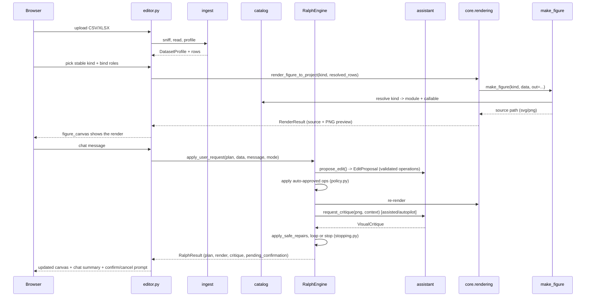

# Architecture

## Package layout

```
sprezzature_figures/
├── make_figure.py, __init__.py     # the library — no Studio dependency
├── catalog/                        # figure registry (FigureDefinition, figures.json)
├── core/                           # domain models + pure logic, no studio/* imports
│   ├── dataset.py                  #   DatasetProfile, ColumnProfile
│   ├── figure_plan.py              #   FigurePlan, StyleOptions, UserIntent
│   ├── operations.py                #   Transform + FigureOperation discriminated unions
│   ├── validation.py                #   validate_operation / validate_plan
│   ├── rendering.py                 #   RenderResult, atomic writes, PNG preview
│   ├── projects.py                  #   ~/.sprezzature-studio/projects/<id>/ layout
│   ├── iterations.py                #   IterationRecord
│   └── history.py                   #   undo/redo/revert/compare
└── studio/                         # everything that needs the `studio` extra
    ├── ingest/                     #   CSV/XLSX/clipboard readers + profiler
    ├── assistant/                  #   LLMClient, schemas, repair, FakeLLMClient
    ├── ralph/                      #   the interactive engine (policy/apply/critic/...)
    ├── export/                     #   .sprezzature.zip bundle
    ├── app.py, cli.py, state.py    #   the NiceGUI app
    ├── pages/editor.py
    └── components/                 #   data_panel, figure_canvas, chat_panel, engine_status
```

`core/` never imports from `studio/*` — it's the layer that could, in
principle, be reused by something other than this specific NiceGUI app.
`studio/*` depends on `core/` and on each other in one direction: `ingest`
→ `assistant`/`ralph` → `pages`/`components`. `ralph/` depends on
`assistant/` (for the LLM client and schemas) but not the reverse.

## Request flow



## Where a render actually lives

Every render is isolated per project, per iteration — never a shared
`assets/` directory (plan §8):

```
~/.sprezzature-studio/projects/<slug>-<8hex>/
├── manifest.json          # ProjectManifest: name, source, current_iteration pointer
├── source/, data/
├── iterations/
│   ├── 0001/
│   │   ├── plan.json      # the FigurePlan after this iteration
│   │   ├── event.json     # the full IterationRecord
│   │   ├── render.svg     # (or render.png, depending on the generator's renderer)
│   │   └── preview.png    # always PNG, for the browser and the VLM
│   └── 0002/
└── exports/
    └── <project-name>.sprezzature.zip
```

Writes are atomic (`core.rendering.atomic_write_bytes`/`atomic_write_text`:
write to a sibling temp file, then `os.replace`), so a crash mid-render
never leaves a truncated file behind.

## Known architectural gap

`RalphEngine.apply_user_request()` takes already-resolved data rows
alongside the `FigurePlan` — it does not execute
`FigurePlan.transformations` (filter/sort/aggregate) against a live
dataset. That data-transformation engine isn't owned by any commit in the
build plan; `transformations` stays the auditable record of what *should*
apply, ready for that engine to consume once it exists. In the current
app, the rows rendered are exactly the imported rows, with role bindings
applied but no transformations executed yet.
