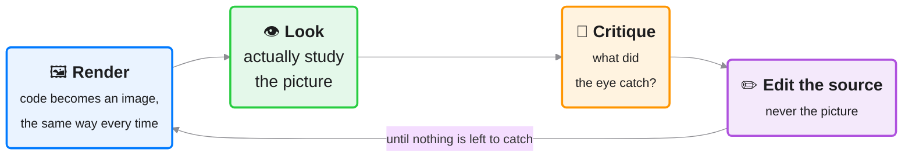

# The Ralph Eyeball Loop

A **visual artifact produced from code can only be judged correctly by
looking at it.** Source code, lint rules, and static auditors catch
structural mistakes (missing labels, bad palettes, duplicate `id`
attributes), but they are blind to what only appears once rendered: a label
that clips, a hero image that pushes the call-to-action below the fold, a
diagram node that collides with its neighbor, a chart that is technically
correct and completely unreadable.

The Ralph Eyeball Loop is the answer. It is a **universal quality technique
for the whole `sprezzature-*` repo**: not a data-viz tool, not a figure-only
concern. Its domain is every surface where a visual is produced from code:

| Surface | Source format | Renderer |
|---|---|---|
| Web pages, GUI screens | `.html`, `.htm` | Headless Chrome (`ralph_eyeball_loop.py`) |
| Data figures | `.vl.json`, `.vg.json` (Vega-Lite / Vega) | `vl-convert` via `render_diagram.py` |
| Mathematical figures | `.tex`, `.tikz` (TikZ / LaTeX) | `tectonic` / `pdflatex` via `render_diagram.py` |
| Flow and architecture diagrams | `.mmd`, `.mermaid` (Mermaid) | `mmdc` via `render_diagram.py` |
| Hand-authored graphics | `.svg` (raw SVG) | `rsvg-convert` / ImageMagick via `render_diagram.py` |

Data visualization is *one* application. A webpage, a UI component, a
marketing screenshot, a deployment-architecture diagram, all go through the
same loop.

---

## The loop

The same house-colored cycle that ships on the
[web page](https://harchaoui.org/warith/sprezzature/ralph-eyeball-loop.html) (source:
`assets/ralph-eyeball-loop.mmd`):



Four steps. The loop is the same for every surface:

1. **Render** — `ralph_eyeball_loop.py` produces a PNG at the size and background
   that matches the real deployment context. For a web page: the desktop and
   mobile viewports. For a Vega spec: white on a light page, transparent on
   a dark hero. For a Mermaid diagram: the background where it will be
   embedded.

2. **Look** — the Claude Code / OpenCode agent reads the PNG back into the
   conversation using the `Read` tool and critiques it with its own vision.
   This is the step that can't be automated: the check that crosses syntax
   and pixel simultaneously.

3. **Assess** — findings go to `.private/ralph-loop/assessment-<hash>.md`
   (gitignored, never committed). The file is extended, not overwritten,
   each iteration so the full history of how the visual evolved is
   preserved. The hash is an 8-char MD5 of the resolved source path, so the
   same source always maps to the same file across sessions.

4. **Edit** — the *source* is improved against the critique. The thing that
   changes is always the `.vl.json`, the `.html`, the `.mmd`: never the
   PNG. The PNG is evidence; the source is the work.

Repeat until the assessment's Verdict box is checked.

---

## Two modes

The loop has two modes. The rendered PNG, the assessment file format, and the
four-step cycle are identical in both. The only difference is *who does the
looking*:

| Mode | Who looks | When to use |
|---|---|---|
| **Agent mode** (default) | The Claude Code / OpenCode agent reads the PNG using its own vision and fills in the assessment manually. | When working inside a Claude Code session; the agent has multimodal vision and can produce richer, context-aware critique. |
| **Local mode** (`--local`) | `qwen3-vl:8b` via Ollama is called automatically after rendering. The critique is pre-filled in the assessment file. | In CI, scripts, or any terminal session without a Claude Code agent. Fully offline once the model is pulled. |

**Note on the one-model rule:** `qwen3-vl:8b` (Qwen3-VL 8B, Q4_K_M) is a
**vision-language model (VLM)**: it accepts images *and* generates text. It is
the single authorized model for the whole `sprezzature-*` repo: the same model backs
every skill's text generation (alt text, captions, narration) and this loop's
visual critique. There is no exception to carve out and no second model to
justify. `test_single_llm.py` enforces that `ralph_eyeball_loop.py`, like every
other Ollama-backed script, declares exactly `qwen3-vl:8b`. See
[docs/LLM_CHOICE.md](../../docs/LLM_CHOICE.md) for the rationale and sources.

To set up local mode:

```bash
# Start Ollama (once, keep it running in the background)
ollama serve

# Pull the vision model (once — ~6.1 GB, Q4_K_M)
ollama pull qwen3-vl:8b
```

---

## The primary tool: `ralph_eyeball_loop.py`

### Agent mode (default)

```bash
# Web page — desktop (default 1440 × 900)
python sprezzature-figures/scripts/ralph_eyeball_loop.py web/index.html

# Mobile viewport (see the note below on Chrome's ~500 px minimum)
python sprezzature-figures/scripts/ralph_eyeball_loop.py web/index.html --width 500 --height 844

# Vega-Lite spec
python sprezzature-figures/scripts/ralph_eyeball_loop.py figs/histogram.vl.json

# Mermaid diagram — transparent canvas
python sprezzature-figures/scripts/ralph_eyeball_loop.py docs/arch.mmd --bg transparent

# TikZ figure — dark canvas
python sprezzature-figures/scripts/ralph_eyeball_loop.py figs/dag.tex --bg dark --dark

# SVG
python sprezzature-figures/scripts/ralph_eyeball_loop.py figs/icon-set.svg
```

The agent reads the PNG with the `Read` tool and fills in the assessment
blanks with its own visual critique.

### Local mode (`--local`)

Add `--local` to any of the above commands:

```bash
# Web page — Ollama vision auto-fills the critique
python sprezzature-figures/scripts/ralph_eyeball_loop.py web/index.html --local

# Data figure — local mode
python sprezzature-figures/scripts/ralph_eyeball_loop.py figs/histogram.vl.json --local

# Mermaid diagram — local mode, dark canvas
python sprezzature-figures/scripts/ralph_eyeball_loop.py docs/arch.mmd --bg transparent --local
```

The assessment file is written with the `qwen3-vl:8b` critique pre-filled.
Review it, edit the source, and re-run.

### Rendering toolchain per surface

Each surface type needs its own PNG renderer. Check what is installed and
auto-install what can be automated:

```bash
# Check which tools are installed
python sprezzature-figures/scripts/ralph_eyeball_loop.py --check-tools

# Install pip and npm tools automatically; print manual steps for the rest
python sprezzature-figures/scripts/ralph_eyeball_loop.py --install-tools
```

**What each surface needs:**

| Surface | Tool | Auto-install | Manual |
|---|---|---|---|
| HTML / JS page | Headless Chrome | — | <https://google.com/chrome/> |
| Vega-Lite / Vega JSON | `vl-convert-python` | `pip install vl-convert-python` | — |
| Mermaid diagram | `mmdc` (mermaid-cli) | `npm install -g @mermaid-js/mermaid-cli` | — |
| TikZ / LaTeX figure | `tectonic` (preferred) | `brew install tectonic` | <https://tectonic-typesetting.github.io/> |
| TikZ rasterise | `pdftoppm` (poppler) | `brew install poppler` | `apt install poppler-utils` |
| SVG graphic | `rsvg-convert` (librsvg) | `brew install librsvg` | `apt install librsvg2-bin` |
| SVG / TikZ fallback | ImageMagick | `brew install imagemagick` | `apt install imagemagick` |
| Local mode critique | Ollama + `qwen3-vl:8b` | `ollama pull qwen3-vl:8b` | <https://ollama.com/> |

`ralph_eyeball_loop.py` auto-detects the surface kind from the file suffix,
renders to `.private/ralph-loop/<stem>-<hash>.png`, and creates or extends
`.private/ralph-loop/assessment-<hash>.md`. Re-running the same command on
the same source file appends the next iteration section; the counter
increments automatically.

For diagram surfaces (Vega, TikZ, Mermaid, SVG), `ralph_eyeball_loop.py`
delegates to `render_diagram.py`, which owns palette theming, toolchain
detection, and output formats. For HTML it calls Chrome headless directly.

---

## The assessment file

`.private/ralph-loop/assessment-<hash>.md` is the working document for a
loop run. It is gitignored (`.private/` is in the top-level `.gitignore`),
local, and structured:

```markdown
# Ralph Eyeball Loop — web/index.html

| Field | Value |
|---|---|
| Source | `web/index.html` |
| Kind   | html |
| Hash   | `a3f7c201` |
| Started | 2026-07-25 14:23 |

---

## Iteration 1 — 2026-07-25 14:23

**PNG:** `.private/ralph-loop/index-a3f7c201.png`

### Critique

**Layout** — ...
**Contrast** — ...
**Hierarchy** — ...
**Spacing** — ...
**Accessibility** — ...
**Colors** — ...
**OCR / text readability** — ...
**First-fold** *(web pages)* — ...
**Overall verdict:** ...

### Planned changes

- Logo at 288 px dominates viewport; shrink to 144 px.
- Hero CTA is below the fold at 1440 px.

### Verdict

- [ ] Satisfied — stop the loop
- [x] Not yet — edit the source and re-run

---

## Iteration 2 — 2026-07-25 14:41

...
```

**Why a file and not a chat message?** The critique must survive the
context window. A file lets the same loop run across multiple conversation
turns, accumulates a diffable history, and can be committed to a PR
description when a visual is shipped (then immediately gitignored again).

---

## What the critique should check

The critique dimensions are not one-size-fits-all; a webpage and a chart
call for different eyes. The assessment template in `ralph_eyeball_loop.py` covers
all surfaces; adapt the emphasis:

### All surfaces

- **Layout** — overall composition; does everything have a place? Is anything
  competing for the same region?
- **Contrast** — can every piece of text and every mark be read against its
  background, at the intended display size?
- **Hierarchy** — does the eye land on the most important element first? Is
  the visual weight in the right place?
- **Colors** — are colors purposeful (encoding data or role) rather than
  decorative? Is the palette color-vision deficiency (CVD) safe?
- **Spacing** — are padding and margins consistent? Does the composition
  breathe, or does it feel cramped / over-padded?

### Web pages and GUI screens (`.html`)

- **First-fold content** — is the key message, heading, or call-to-action
  (CTA) visible at the target viewport *without scrolling*? Check both
  desktop (1440 px) and mobile (500 px, see the viewport-clamp note below).
- **Typography** — is the type scale legible? Are heading and body sizes
  proportional?
- **Dark mode** — if the page supports `data-color-scheme="dark"`, render
  at both appearances. Contrast must hold in both.
- **Responsiveness** — does the layout degrade gracefully on the mobile
  viewport?

> **Viewport-clamp gotcha (read before trusting a "mobile" render).** Headless
> Chrome enforces a **minimum window width of ~500 px**. Ask for `--width 375`
> and Chrome still lays the page out at ~485 px, then *crops* the screenshot to
> 375, which looks exactly like a horizontal-overflow bug that does not exist.
> `ralph_eyeball_loop.py` therefore clamps any width below 500 px up to 500 and
> prints a warning, and passes `--hide-scrollbars` so the CSS viewport equals
> the window width (no 15 px scrollbar drift). A 500 px render is a faithful
> large-phone view; below Tailwind's `sm` (640 px) breakpoint it exercises the
> mobile layout. For a **pixel-true 375 px phone**, the flag-only path cannot
> emulate it; open the page in a real browser's device-mode. When a mobile
> critique claims "overflow / clipped text", confirm it is real (measure
> `document.documentElement.scrollWidth` vs `clientWidth`) before editing the
> page: it is usually this clamp, not the CSS.

### Data figures (Vega, TikZ)

- **Axis labels and tick labels** — do they overlap? Are they readable at the
  intended print size?
- **Legend placement** — is the legend on-canvas? Does it occlude data?
- **Baseline** — is the y-axis baseline correct for the scale (zero for a
  ratio scale; otherwise defensible)?
- **Chartjunk** — background gradients, drop shadows, unnecessary grid lines?
- **Polarity** — does the chart state whether "higher is better" or "lower is
  better" when a direction exists?

### Diagrams (Mermaid, SVG)

- **Node collisions** — are any labels or boxes overlapping?
- **Edge routing** — do edges cross unnecessarily? Are arrowheads readable?
- **Text in nodes** — legible at the rendered size? Does wrapping break the
  layout?
- **Clip / crop** — is anything cut off at the canvas edge?

---

## Why the agent is the critic

In **agent mode**, the visual judge is **the Claude Code / OpenCode agent
itself**, the model running this repository, which can see images via the
`Read` tool. In **local mode**, the judge is `qwen3-vl:8b` via Ollama, the
same single authorized model the skills already use for text. Either way the
renderers (`ralph_eyeball_loop.py`, `render_diagram.py`) call no model of their
own: they rasterize; the VLM looks. The repo stays on exactly one model.

---

## Web pages: `render_web.sh` as a thin alias

`scripts/render_web.sh` (in the repo root) is a Bash convenience wrapper for
the HTML screenshot step, useful when you want a quick render without the
assessment file machinery:

```bash
# Quick desktop screenshot
scripts/render_web.sh web/index.html

# Mobile
scripts/render_web.sh web/index.html .private/screenshots/home-mobile.png 375 812
```

For the full loop with assessment tracking, use `ralph_eyeball_loop.py`. For a quick
spot-check or a one-shot before/after comparison, `render_web.sh` is
sufficient.

---

## Never ASCII art — always colored Mermaid

**Do not draw diagrams in ASCII art.** A `+----+  --->  [ box ]` sketch in a
code fence or a docstring is unreadable, un-styleable, and impossible to
maintain.

When you are tempted to reach for box-drawing characters, write a **Mermaid**
diagram instead and run it through this loop. Mermaid is first-class here
because `render_diagram.py` injects the **sprezzature-colors palette** as its theme
(`%%{init}%%`), so you get on-brand, colored, readable nodes and edges for
free, then eyeball and refine:

```bash
python sprezzature-figures/scripts/render_diagram.py flow.mmd \
    --background transparent --out flow.png   # → look → refine flow.mmd
```

Strict preference order:

> **Ralph-Eyeball-Loop Mermaid-with-colors  >  Mermaid + colors  >  ASCII art**

A colored Mermaid diagram you have *rendered, looked at, and refined* through
this loop beats one you merely wrote with colors, which beats ASCII art (which
is never acceptable). Writing the Mermaid is not the finish line;
eyeballing the rendered image is. Reach for TikZ when the figure is
mathematical or print-grade, and Vega when it is a data chart, but never
leave a diagram as ASCII, and never leave a diagram un-eyeballed.

---

## Vega first, SVG as the fallback

For a data figure, the engine choice is a policy, not a guess:

1. **Try Vega first.** Author the spec, run the loop (render → look →
   refine). Vega is preferred: the spec carries its own data, themes to the
   house style, and is interactive in a page.
2. **If the Vega loop can't get there** (the grammar cannot express it: a
   smoothing filter, arrowhead markers, a gradient mesh), **drop to a
   hand-authored SVG** and run the *same* loop on it.

This is how the catalog was built: hexbin, 2D-KDE contours, beeswarm,
clustermap, quiver, and static 3D surfaces stayed in Vega; interpolated
`imshow` (smooth raster) and `streamplot` (arrowheads) needed SVG. The full
map is `FIGURES.md`; the Vega dead ends are in `.private/vega-failures/FAILURES.md`.

---

## Palette first — every surface

Every render is themed from the **canonical sprezzature-colors palette**
(`sprezzature-colors/references/palette.csv`, documented at
<https://harchaoui.org/warith/colors/>) before you look:

- **Vega** — `_style.vega_config` applies the theme on the make side; the
  spec's own `config` overrides per-figure.
- **TikZ** — a `\definecolor` preamble injected by `render_diagram.py`.
- **Mermaid** — the `%%{init}%%` theme injected automatically.
- **HTML / web** — the sprezzature-ui CSS variables carry the palette; the page
  already uses it.

The palette is the *first* choice. Edit specific hues in the source when a
figure needs it. Pass `--no-theme` to `render_diagram.py` to render a source
verbatim, without injection.

---

## Background: match the embedding context

Set the canvas to match where the graphic lands:

| Flag | When to use |
|---|---|
| `--bg white` | Drop onto a light page or print. Default. |
| `--bg transparent` | Overlay on a colored section, or a dark-mode hero. |
| `--bg dark` | The house dark canvas (`#1D1D1F`); use with `--dark`. |
| `--bg '#RRGGBB'` | Any explicit hex. |

For web pages (`--width` / `--height`), the background is owned by the page's
own CSS; `--bg` is ignored and Chrome renders what the page declares.

---

## Completing the loop: gate before ship

The Ralph Eyeball Loop handles visual quality: what only appears once
rendered. Two additional checks gate the output before a commit:

- **Diagram sources** — `audit_figure.py` catches structural anti-patterns in
  the *source* (missing axis labels, rainbow palettes, dual axes, missing
  `role="img"`). Run it after the loop, not instead of it.
- **Web pages** — `sprezzature-accessibility/scripts/lint_a11y.py` checks every
  HTML page for accessibility findings (missing `alt`, contrast, landmark
  roles). The loop's accessibility critique and the linter cover different
  failure modes; both must pass.

```bash
# Diagram: audit after looping
python sprezzature-figures/scripts/audit_figure.py figs/histogram.vl.json

# Web page: a11y gate after looping
python sprezzature-accessibility/scripts/lint_a11y.py web/index.html
```

Neither gate replaces the loop. The loop catches what a parser misses; the
gates catch what the loop misses. Use both.

## Extending the loop to interactive and animated figures

A static PNG is one frame. When the artifact is **interactive** (a Vega chart
with tooltips and zoom, an SVG map with hover-highlight) or **animated** (an
animated SVG, a Vega `view.timer`), one frame is not enough to judge it; you
have to drive it and look at each state.

The loop generalises cleanly: instead of a single render, capture a
**storyboard** of states and look at the whole set.

- **Default** — the figure as it first paints.
- **Hover** — dispatch a `mouseover` on a mark; is the tooltip showing the right
  value? does the correct element highlight?
- **Zoom / pan** — after a wheel or drag; do labels survive, does it stay legible?
- **Selection / brush** — after a drag-select; is the intended subset highlighted?
- **Keyboard focus** — after `Tab`; is the focus ring visible, the order sane?
- **Animation frames** — advance the clock and sample a few frames; does the
  motion read, and does it settle?

Mechanically this is the same headless-Chrome instance the HTML path already
uses: *dispatch an event (or advance time) → wait for paint → screenshot*, one
frame per state, assembled into a contact sheet. The critique then judges
**behaviour**, not just layout (the questions above), and the edit still lands
on the source. Agent mode reads the contact sheet; `--local` runs the vision
model over each frame. (Interactive/animated capture is part of the
interactive-SVG roadmap; the single-frame loop above is what ships today.)

## Colour-blindness and grayscale — one more render

Colour can carry a whole dimension of a chart, and whether it survives a
colour-blind reader is a question only the pixels can answer. So after the
render, run one more: `simulate_cvd.py` redraws the image in grayscale and under
protanopia, deuteranopia and tritanopia, and lays them out as a contact sheet.
The loop becomes **render → simulate → look**.

This is where `make`, `audit` and the Eyeball Loop meet. `make` proves the
figure runs and carries its own data; `audit_figure.py` proves the source is
clean (no rainbow ramp, no blur filter, no missing title); the simulator proves
the result still reads once the colour is gone or shifted. Each catches what the
other two can't.

The rule it enforces: colour is never the sole channel. If a series or a
plus-or-minus sign vanishes in the sheet, add a second channel: a sign, a value
label, a marker shape, a stroke style. And for signed data, prefer the
**blue ↔ red** diverging pair over red ↔ green: the red-green pair collapses to
one muddy hue under the common colour blindnesses, while blue ↔ red stays
legible. The pair is available as `_style.diverging_pair(cvd_safe=True)`.

### The loop gives you eyes you do not have

This is the consequence worth dwelling on. A viewer with normal colour vision
cannot see their own chart the way a colour-blind reader does, and no amount of
care changes that, because the information is simply not in their eye. The
simulator closes that gap. It renders the other viewpoints, and the loop lets you
*look* at them, so accessibility stops being a checklist you take on trust and
becomes something you can actually see and correct. The review a person cannot
physically perform becomes an ordinary step.

Greyscale is the sharpest single test. Total colour blindness is rare, but a
design that reads with no colour at all reads under every milder deficiency too,
so the grey sheet is the one to trust first. If the story survives grey, it
survives everyone.

### Looking across accessibility levels

The palette now takes an accessibility *level*: `load_palette(accessibility=...)`
in the generators, and `--accessibility` on their command lines. The levels are
`universal` (the default, the colour-vision-safe standard everyone gets),
`high-contrast`, `monochrome`, and the per-deficiency `deuteranopia`,
`protanopia`, and `tritanopia` variants. One figure becomes a short ladder of
renders, and the loop climbs it: render each level, simulate, look. You confirm
the default reads for everyone, and that each stronger level does what it
promises, with the same eyes in the same loop. The model and its sources are in
`sprezzature-colors/references/accessibility-levels.md`.
